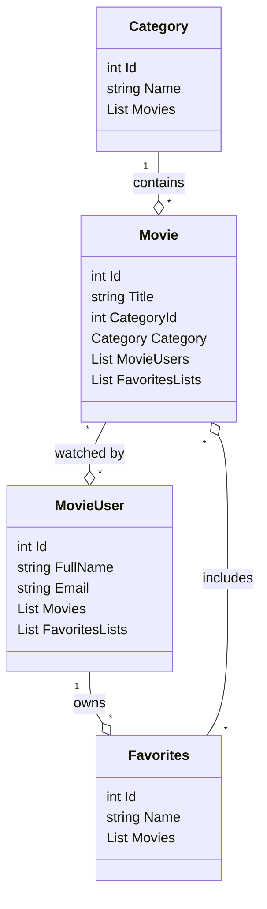

# Models Relationship Diagram

```mermaid
classDiagram
    class Category {
        int Id
        string Name
        List<Movie> Movies
    }
    class Movie {
        int Id
        string Title
        int CategoryId
        Category Category
        List<MovieUser> MovieUsers
        List<Favorites> FavoritesLists
    }
    class MovieUser {
        int Id
        string FullName
        string Email
        List<Movie> Movies
        List<Favorites> FavoritesLists
    }
    class Favorites {
        int Id
        string Name
        List<Movie> Movies
    }

    Category "1" --o "*" Movie : contains
    Movie "*" --o "*" MovieUser : watched by
    MovieUser "1" --o "*" Favorites : owns
    Favorites "*" --o "*" Movie : includes
```
